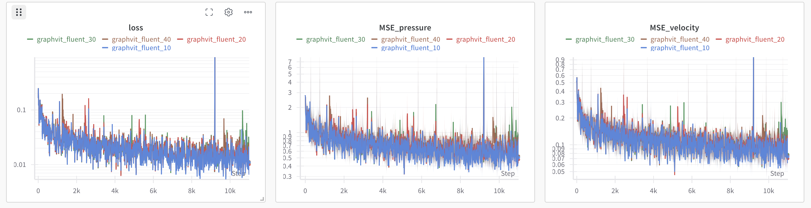
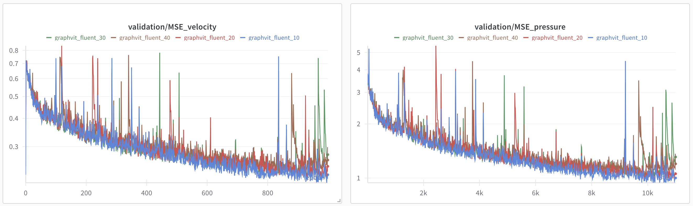

# EAGLE: Large-scale Learning of Turbulent Fluid Dynamics with Mesh Transformers
 
This repository contains the code associated to the paper <a href="https://openreview.net/forum?id=mfIX4QpsARJ">EAGLE: Large-scale Learning of Turbulent Fluid Dynamics with Mesh Transformers</a>


[](https://eagle-dataset.github.io/)
[](https://arxiv.org/abs/2302.10803)
[](https://datasets.liris.cnrs.fr/eagle-version1)


# Abstract
Estimating fluid dynamics is classically done through the simulation and integration of numerical models solving the Navier-Stokes equations, which is computationally complex and time-consuming even on high-end hardware. This is a notoriously hard problem to solve, which has recently been addressed with machine learning, in particular graph neural networks (GNN) and variants trained and evaluated on datasets of static objects in static scenes with fixed geometry. We attempt to go beyond existing work in complexity and introduce a new model, method and benchmark. We propose EAGLE, a large-scale dataset of ∼1.1 million 2D meshes resulting from simulations of unsteady fluid dynamics caused by a moving flow source interacting with nonlinear scene structure, comprised of 600 different scenes of three different types. To perform future forecasting of pressure and velocity on the challenging EAGLE dataset, we introduce a new mesh transformer. It leverages node clustering, graph pooling and global attention to learn long-range dependencies between spatially distant data points without needing a large number of iterations, as existing GNN methods do. We show that our transformer outperforms state-of-the-art performance on, both, existing synthetic and real datasets and on EAGLE. Finally, we highlight that our approach learns to attend to airflow, integrating complex information in a single iteration.

# Installation
Using Mamba as package manager (should also work with conda):
```bash
mamba create -n eagle python=3.9
mamba activate eagle
conda install pytorch==2.4.1 torchvision==0.19.1 torchaudio==2.4.1 pytorch-cuda=12.4 -c pytorch -c nvidia
mamba install pytorch-scatter -c pyg
mamba install matplotlib tqdm numba
```

# Dataset
You can download the dataset on this <a href="https://datasets.liris.cnrs.fr/eagle-version1"> link</a>. Simulations data are stored in a single numpy archive file (.npz), containing nodes 2D positions, types, velocity and pressure. The edges are stored in another file (triangles.npy) as triplet of points. Below are the SHA25 sums of each files:
```
f1bbc1dc22b0fbc57a5f8d0243d85f6471c43585fb0ecc7409de19996d3de12c  eagle_clusters.tar.gz
f73cb9a443011646fb944e0a634a0d91c20b3d71a8b4d89d55486f9e99bdca78  spline.tar.gz
ac04d3efb539a80d8538fb8214228652b482ab149fc7cc9ecf0b6d119e3b1be7  step.tar.gz
59a2ae96ca5ade7d3772e58b302c4132e1ee003ac239b7e38973ceb480a979e6  triangular.tar.gz
```
 # Training
Use the following command to train our model:
```bash
python train_graphvit.py --dataset-path XX --cluster-path XX --run-id "graphvit_10" --output-path "trained_models/graphvit" --n-cluster=10
```

For reference, below are screenshots of the training curves for the pre-trained models:





Note that the script requires a path to the pre-computed clusters. These clusters are available for download on the dataset page.
If necessary, you can also recompute the clusters using the script ```clusterize_eagle.py```.
```bash
python clusterize_eagle.py --max_cluster_size XXX --geom "Spl" --traj 1
```

# Evaluating
You can evaluate a pre-trained model using the script ```eval_graphvit.py```.

The metric used in the paper is a normalized MSE on the pressure and velocity fields:

$$ \text{N-RMSE}(T) =  \frac{1}{TB}\sum_{b=1}^B \sum_{t=1}^T\frac{1}{N_b} \sum_{n=1}^{N_b} \frac{\|v_n^b(t) - \hat v_n^b(t)\|_2}{\|\sigma_v\|^2} + \frac{\|p_n^b(t) - \hat p_n^b(t)\|_2}{\|\sigma_p\|^2}$$

where:
- $B$ is the total number of batches, indexed with $b$, 
- $T$ is the number of timesteps indexed with $t$,
- $N_b$ is the number of nodes in the batch $b$, indexed with $n$,
- $v_n^b(t)$ and $p_n^b(t)$ are the ground truth velocity and pressure at node $n$ in batch $b$ at timestep $t$,
- $\hat v_n^b(t)$ and $\hat p_n^b(t)$ are the predicted velocity and pressure,
- $\sigma_v$ and $\sigma_p$ are the standard deviation of the velocity and pressure fields. The script use the values hard-coded in the data loader.
- $\|.\|_2$ is the L2 norm (Euclidean distance).

```bash
python python eval_graphvit.py --ckpt "trained_models/graphvit/fluent/graphvit_fluent_10.nn" --dataset-path XX --cluster-path XX --n-cluster 10
100%|██████████████████| 118/118 [10:54<00:00,  5.55s/it, error_1=0.0811, error_50=0.352, error_250=0.634]
```
# Generate visualizations
If you want to reproduce similar videos as in the project page, we release our script for generating visualizations. The script is located in the folder ```misc```. You can run the script with the following command:

``` python misc/export_video.py ```

It will generate videos of the Eagle dataset.

# Citation
```   
 @inproceedings{janny2023eagle,
        title = "EAGLE: Large-scale Learning of Turbulent Fluid Dynamics with Mesh Transformers",
        author = {Steeven Janny and
                  Aurélien Benetteau and
                  Nicolas Thome and Madiha Nadri and Julie Digne and Christian Wolf},
        booktitle = "International Conference on Learning Representations (ICLR)",
        year = "2023"}
```

**Maintenance**: I will try to maintain this repository as much as possible, but I cannot guarantee that I will be able to answer rapidly to all the questions.